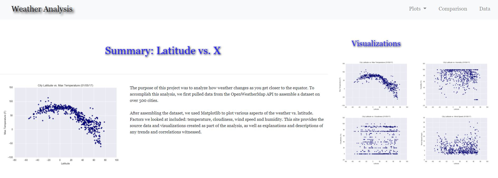

# Web-Design-Challenge

<h1>WeatherPy</h1>  
<ul>
  <li>A series of scatter plots and linear regressions were created to showcase the relationships between a cities' distance from the equator and various weather conditions.</li> 
  <li>Scatter plot images were saved as PNG files to be used in the dashboard.</li>
  <li>Using OpenWeatherMap API, I was able to randomly retrieve latitude and longitude info from 500+ cities.</li>
  <li>Perform a weather check on each of the cities using a series of successive API calls.</li>
  <li>Include a print log of each city as it's being processed with the city number and city name.</li>
  <li>Save a CSV of all retrieved data and a PNG image for each scatter plot.</li>
</ul>
<h1>Dashboard </h1> 
 
 
<ul>
  <li> Analysis and scatter plots displayed as a dashboard</li>
  <li> Includes a table of data on all cities randomly chosen with the OpenWeatherMap API</li>
  <li> Dashboard created using HTML, CSS, and Bootstrap
   
